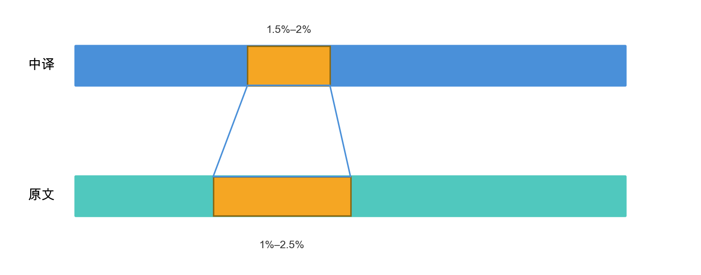

# 双语文本对齐工具

基于大语言模型的双语文本对齐工具，适用于翻译校对、平行语料库构建等场景。

## 原理

先确定中文段落在全篇的位置比例，比如某一段在1.5%–2%，那么原文段落也大概在这个区间，加上前后冗余量（如1%–2.5%），把这两个文本送给AI，让它找出精确对应的原文。



## 使用方法

```bash
# 输入两个文件，输出对齐好的CSV
python align.py file1.txt file2.txt

# 指定输出文件
python align.py file1.txt file2.txt -o result.csv

# 仅做粗对齐（不调用AI）
python align.py file1.txt file2.txt --skip-ai
```

## 配置

1. 复制 `api_keys.txt.example` 为 `api_keys.txt`
2. 填入你的API密钥（每行一个）

或通过环境变量配置：
```bash
export ALIYUN_DEEPSEEK_API_KEYS="key1,key2,key3"
```

## 输出格式

| _index | text_a | text_b |
|--------|--------|--------|
| 0 | 第一个文件的段落 | 第二个文件对应的段落 |
| 1 | ... | ... |

## 依赖

```bash
pip install pandas requests tqdm
```

## License

MIT
