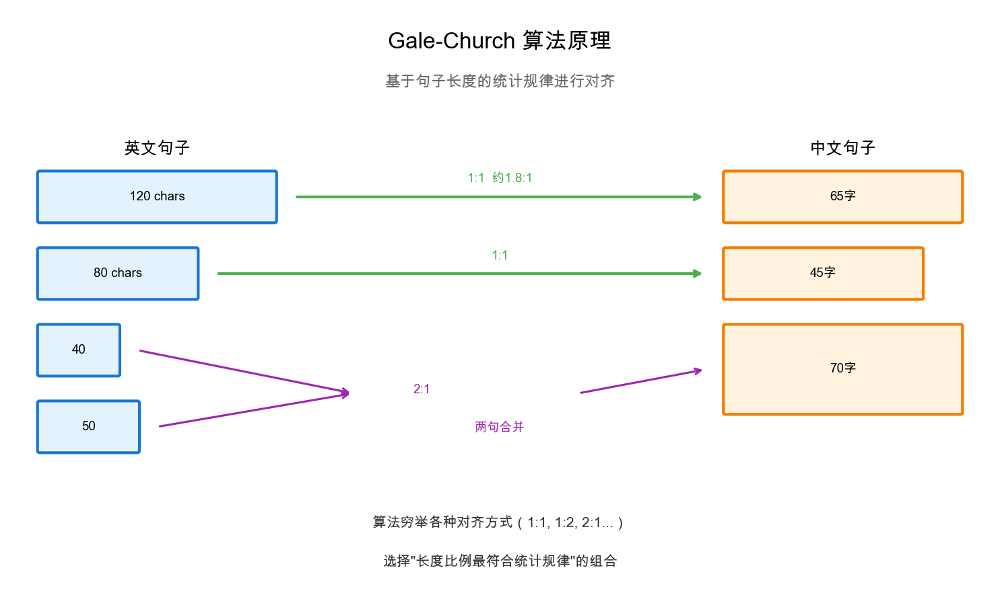
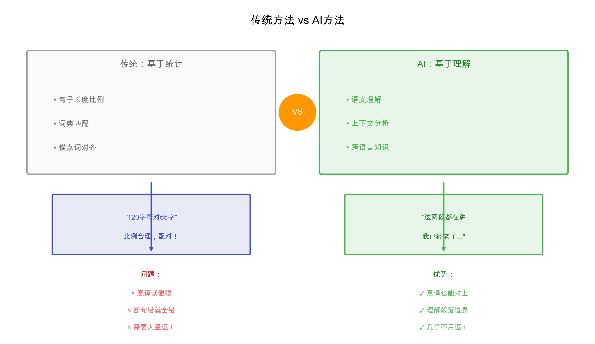
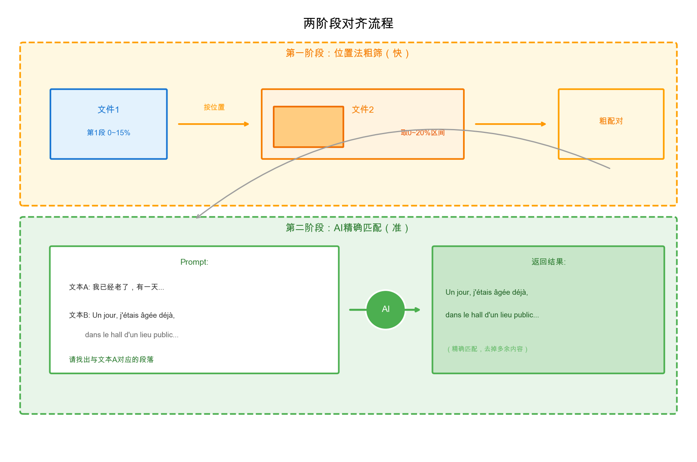

# 双语文本对齐：从专业工具到AI方案

做翻译校对的朋友大概都有这种烦恼：手头一本外文书，一本中文译本，想把原文和译文一段段对应起来。人工对？几百页的书，对到眼花也对不完。

这套工具就是干这个的。

## 问题是什么

假设你有杜拉斯《情人》的法文原文和王道乾的中译本：

**法文原文：**
```
Un jour, j'étais âgée déjà, dans le hall d'un lieu public,
un homme est venu vers moi. Il s'est fait connaître et il
m'a dit « Je vous connais depuis toujours... »
```

**中文译文：**
```
我已经老了，有一天，在一处公共场所的大厅里，有一个男人
向我走来。他主动介绍自己，他对我说："我认识你，永远记得你..."
```

人眼一看就知道谁对谁，但让机器来做就没那么简单了——两边的断句方式不一样，段落数量也可能不同，有时候译者还会合并或拆分段落。

---

## 没有AI的时代：传统对齐工具

在大模型出现之前，文本对齐这活儿已经有人在做了，而且做了几十年。

### Gale-Church 算法（1993年）

最经典的是两位Bell实验室研究员提出的 Gale-Church 算法。原理出奇地简单：**不同语言的句子长度存在统计规律**。

比如英文100个字符，翻译成德语大概也是100个字符左右，翻译成中文可能是50-60个字符。这个比例在大量文本上是稳定的。



这个算法成了后来很多对齐工具的基础。

### 常用的对齐工具

**LF Aligner**：大概是用得最多的免费工具，有图形界面，底层用的是 hunalign 算法。导入两个文件，点一下就能对齐，还能手动调整结果。做翻译的朋友应该不陌生。

**Hunalign**：命令行工具，除了句子长度，还可以加载双语词典来提高准确率。开源，很多人拿它做语料库。

**Bleualign**：思路很妙——先用机器翻译把一边翻成另一边的语言，再去对齐。这样就变成了"同语言"的相似度匹配，准确率能提高不少。

**商业工具**：SDL Trados、memoQ 这些翻译软件都自带对齐功能，效果还行，但要花钱。

### 传统工具的痛点

用过这些工具的都知道，它们有几个老毛病：

1. **句子边界识别差**：遇到缩写、引号、省略号就容易断错。"Dr. Smith said..."，它可能在Dr后面就给你断了。

2. **长段落容易乱**：如果原文一段话译文拆成三段，或者反过来，基于长度的算法就开始犯迷糊。

3. **需要大量人工校正**：对完一看，总有一堆错位的，得一条条手动调。几百页的书，返工量相当可观。

4. **不理解内容**：它只看长度和词典，不懂"斯大林"和"Stalin"是同一个人，遇到意译、增译、减译就傻眼。

---

## 有了AI之后：让模型来理解

大语言模型最强的地方在于：**它真的能读懂内容**。

你给它一段中文"斯大林出生于格鲁吉亚的哥里"，再给它一段英文候选，它能理解这是在说同一件事，然后精确地把对应的英文挑出来——哪怕原文里夹杂着前后段的内容。



### 我们的两阶段方案

直接让AI处理整本书？不现实——上下文窗口塞不下，塞下了也贵得吓人。

所以我们分两步走：

**第一阶段**：用简单的位置比例法做"粗筛"。文件1第一段在0%~15%的位置，就把文件2的0%~20%那一块切出来作为"候选区"。这步快得很，几秒钟处理完整本书。

**第二阶段**：把每个配对扔给AI，让它精确找出对应的内容。



这套组合拳的好处是：位置法负责"快"，AI负责"准"，扬长避短。

---

## 对齐完了能干嘛

花这么大力气把文本对齐，总得有点用处吧：

### 1. 翻译校对

这是最直接的用途。对齐之后，原文译文左右对照，一眼就能看出：

- **漏译**：原文有这句，译文没有
- **多译**：译文多出来的内容
- **误译**：意思对不上的地方
- **术语不一致**：同一个词前后翻译不同

以前校对一本书得来回翻页对照，现在打开CSV一目了然。

### 2. 构建翻译记忆库（TM）

对齐好的句对可以直接导入翻译记忆库。下次翻类似的书，Trados/memoQ会自动提示"这句以前翻过"，直接复用或参考。

做技术翻译的尤其受用——同一个产品线的文档，术语和句式高度重复，有了TM效率翻倍。

### 3. 训练机器翻译模型

没有对齐好的平行语料，就没有现代机器翻译。

Google翻译、DeepL背后都是海量的对齐句对在支撑。想训练一个特定领域的翻译模型（比如医学、法律），第一步就是搞到这个领域的对齐语料。

### 4. 术语提取

对齐语料是提取双语术语的宝库。

跑一个词对齐算法，就能自动发现"人工智能 ↔ artificial intelligence""深度学习 ↔ deep learning"这样的对应关系。拿来编术语表、建术语库都很方便。

### 5. 语言研究

比较语言学、翻译学的研究者经常需要分析"同一个意思在两种语言里怎么表达"。对齐语料就是现成的研究材料。

---

## 输出格式

对齐结果保存在 `aligned_result.csv`，格式如下：

| _index | text_a | text_b |
|--------|--------|--------|
| 0 | Un jour, j'étais âgée déjà, dans le hall d'un lieu public, un homme est venu vers moi... | 我已经老了，有一天，在一处公共场所的大厅里，有一个男人向我走来... |
| 1 | Je pense souvent à cette image que je suis seule à voir encore... | 这个形象，我是时常想到的，这个形象，只有我一个人能看到... |

`text_a` 和 `text_b` 分别对应两个输入文件的对齐段落。

---

## 代码结构

整个流程在 `align.py` 一个文件里搞定：

### 第一阶段：位置法粗对齐

```python
def rough_align(text1, text2, window_size=0.01):
    # 计算text1每段的位置百分比
    for para, start_pct, end_pct in text1_ranges:
        # 按比例在text2里找对应区间，留点余量
        text2_start = (start_pct - window_size*2) * len(text2)
        text2_end = (end_pct + window_size) * len(text2)

        # 切出候选区
        candidate = text2[text2_start:text2_end]
```

### 第二阶段：AI精确对齐

```python
# AI自动识别语言，不用指定
SYSTEM_PROMPT = """你是双语对齐助手。
给你两段不同语言的文本，文本A较短，文本B较长。
请在文本B中找出与文本A对应的段落。
只返回匹配的内容，不要解释。"""

def align_pair(text_a, text_b):
    prompt = f"文本A:\n{text_a}\n\n文本B:\n{text_b}"
    result = call_api(prompt)
    return result
```

还有一些工程细节：多线程并行、多API密钥轮换、断点续传。跑到一半断了也不怕，下次自动接着来。

---

## 使用方法

```bash
# 输入两个文件，输出对齐好的CSV
python align.py english.txt chinese.txt

# 指定输出文件
python align.py english.txt chinese.txt -o result.csv

# 仅做粗对齐（不调用AI，速度快）
python align.py english.txt chinese.txt --skip-ai
```

两个文件顺序无所谓，语言也不用指定，AI会自动识别。

API密钥放在 `api_keys.txt` 里，每行一个，支持注释。跑之前会先处理两条样本让你确认效果，没问题再继续。

中断后重新运行会自动恢复进度，不用担心白跑。

---

## 最后

文本对齐这事儿，说大不大说小不小。传统工具能用，但总有种"隔靴搔痒"的感觉——它不懂你在说什么，只是在机械地匹配数字。

有了大模型之后，终于可以让机器"读懂"内容再来对齐，准确率上了一个台阶。当然这套方案也不是万能的，遇到原文译文差异太大的情况（比如编译、大幅删改），还是得靠人工。

但对于大多数"正常"的翻译作品，这套"粗筛+精对"的组合应该够用了。

---

*工具地址：就在这个文件夹里*
